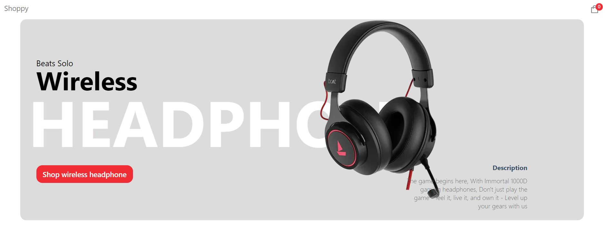
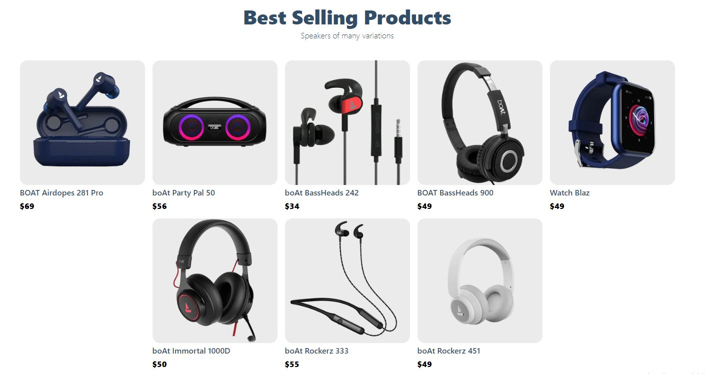
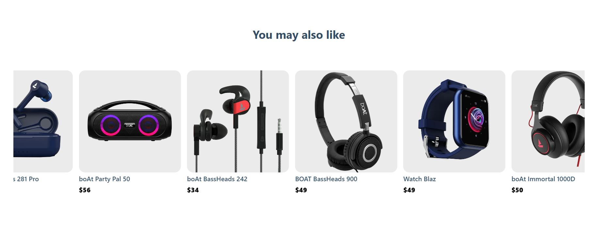
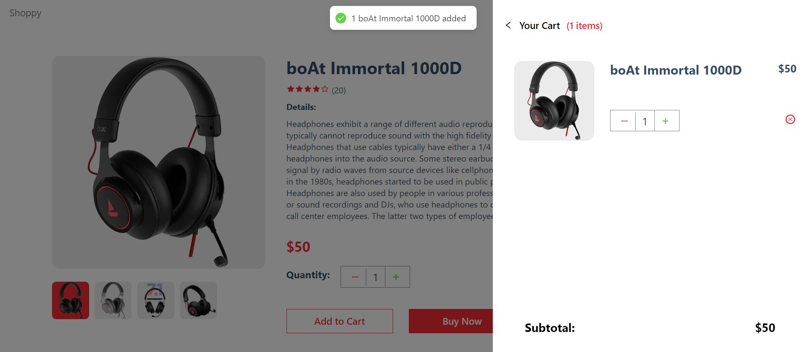
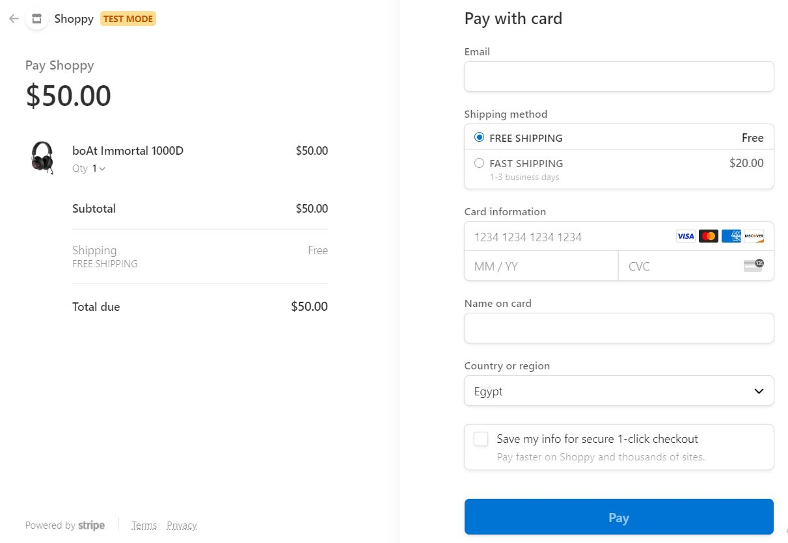
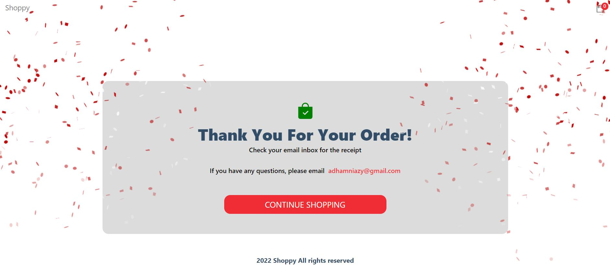

# Shoppy

## An ecommerce website for buying electronics stuff 🛒💰💵

Things used in this project:

1. NextJs Framework
2. **Sanity** (Really a great CMS for making all your site content dynamic with an amazing dashboard control)
3. **StripeJs** (For handling payments)
4. Context API (For managing application state)
5. NextJs Backend (For creating endpoint for handling stripe operations payment)
6. Canvas Confetti (For creating nice canvas celebrations upon success payments)
7. No CSS framework
8. Vercel (For hosting && basic CICD)

This Application ([Shoppy](https://shoppy-ten.vercel.app/)) has the following pages:

- Home page contains the latest sales on our site, best seller items
- Product details page
- Cart details component
- Stripe Payment Page
- Success Page that comes after a successfull payment

<h1 align="center">Home Page</h1>

<h1 align="center">Product Details Page</h1>

<h1 align="center">Cart Details</h1>

<h1 align="center">Stripe Page</h1>

<h1 align="center">Success Page</h1>

